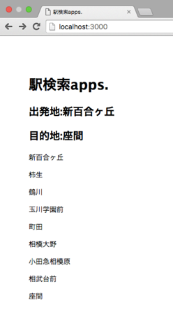

# EKIApp
[駅データ.jp](http://www.ekidata.jp/)のデータをAPIを叩いて何かしてみようという構想

## 目標
* 入力は出発地と目的地
* 出力は目的地までの最短経路で行った場合の乗り換え駅
* 例)
	+ 入力:s=登戸駅,g=渋谷駅
	+ 出力:登戸駅->下北沢駅->渋谷駅
* ウェブアプリケーションとしてアプリ化
* 入力もクエリで投げるのではなくフォームから投げたい


## 05/15
* データベースからすべての情報を取得->表示ができた

## 05/22

### DB構成

#### Station_Nameテーブル

|Station_ID|Name|
|:---------|:-----|
|2500101|新宿|
|2500102|南新宿|
|2500103|参宮橋|
|2500104|代々木八幡|
|2500105|代々木上原|
|2500106|東北沢|
|2500107|下北沢|
|2500108|世田谷代田|
|2500109|梅ヶ丘|
|2500110|豪徳寺|
|2500111|経堂|
|2500112|千歳船橋|
|2500113|祖師ヶ谷大蔵|
|2500114|成城学園前|
|2500115|喜多見|
|2500116|狛江|
|2500117|和泉多摩川|
|2500118|登戸|
|2500119|向ヶ丘遊園|
|2500120|生田|
|2500121|読売ランド前|
|2500122|百合ヶ丘|
|2500123|新百合ヶ丘|
|2500124|柿生|
|2500125|鶴川|
|2500126|玉川学園前|
|2500127|町田|
|2500128|相模大野|
|2500129|小田急相模原|
|2500130|相武台前|
|2500131|座間|
|2500132|海老名|
|2500133|厚木|
|2500134|本厚木|
|2500135|愛甲石田|
|2500136|伊勢原|
|2500137|鶴巻温泉|
|2500138|東海大学前|
|2500139|秦野|
|2500140|渋沢|
|2500141|新松田|
|2500142|開成|
|2500143|栢山|
|2500144|富水|
|2500145|螢田|
|2500146|足柄|
|2500147|小田原|


#### Line_Table

|Line_ID|dex|Station_ID|
|:-|:-|:-|
|25001|0|2500101|
|25001|1|2500102|
|25001|2|2500103|
|25001|3|2500104|
|25001|4|2500105|
|25001|5|2500106|
|25001|6|2500107|
|25001|7|2500108|
|25001|8|2500109|
|25001|9|2500110|
|25001|10|2500111|
|25001|11|2500112|
|25001|12|2500113|
|25001|13|2500114|
|25001|14|2500115|
|25001|15|2500116|
|25001|16|2500117|
|25001|17|2500118|
|25001|18|2500119|
|25001|19|2500120|
|25001|20|2500121|
|25001|21|2500122|
|25001|22|2500123|
|25001|23|2500124|
|25001|24|2500125|
|25001|25|2500126|
|25001|26|2500127|
|25001|27|2500128|
|25001|28|2500129|
|25001|29|2500130|
|25001|30|2500131|
|25001|31|2500132|
|25001|32|2500133|
|25001|33|2500134|
|25001|34|2500135|
|25001|35|2500136|
|25001|36|2500137|
|25001|37|2500138|
|25001|38|2500139|
|25001|39|2500140|
|25001|40|2500141|
|25001|41|2500142|
|25001|42|2500143|
|25001|43|2500144|
|25001|44|2500145|
|25001|45|2500146|
|25001|46|2500147|


### アプリ進捗状況

* データベース上には小田急小田原線のデータが存在。
* start:新百合ヶ丘,goal:座間として、途中駅をすべて表示する。

#### SQL文
```SQL
Select Name from Station_Name where Station_ID >=
(Select min(Station_ID) From Station_Name where
( Name ="新百合ヶ丘" or  Name = "座間")) and Station_ID <=
(Select max(Station_ID) From Station_Name where
( Name ="新百合ヶ丘" or  Name = "座間"))
```
#### Webページ表示例



### コード
#### routes/index.html
``` js
var express = require('express');
var router = express.Router();
var mysql = require("mysql");


router.get("/",function(req,res,next){
	var connection = mysql.createConnection({
	host     : 'db01',
	user     : 'root',
	password : '******',  //passwordなのでマスクしている
	database : "TrainLine"
	});

	connection.connect(function(err) {
		if (err) {
			console.error('error connecting: ' + err.stack);
			return;
		}

	console.log('connected as id ' + connection.threadId);
	});
	s = "新百合ヶ丘"
	g = "座間"
	ans = ""
	connection.query('Select Name from Station_Name where Station_ID >= (Select min(Station_ID) From Station_Name where ( Name ="'+s+'" or  Name = "'+g+'")) and Station_ID <= (Select max(Station_ID) From Station_Name where ( Name ="'+s+'" or  Name = "'+g+'"))', function(error, rows, fields) {
		console.log(rows[0]["Name"]);
		for(var i = 0; i < rows.length;i++){
			ans += rows[i]["Name"];
		}
		console.log(ans);
		res.render('index',{title:"駅検索apps.",elm:rows,start:s,goal:g});
	});
});
module.exports = router;

```

#### views/index.jade
``` jade
extends layout

block content
  h1 #{title}
  h2 出発地:#{start}
  h2 目的地:#{goal}
  each val in elm
    p #{val["Name"]}

```


### 予定
* 任意のstartとgoalを受け付ける
* 下りは正しく表示されるが、上りの場合、行きたい順序とは逆に表示されるので、直したい。
* フォームを作り、フォームからstartとgoalの受け取り
* 小田急線全体に拡張
